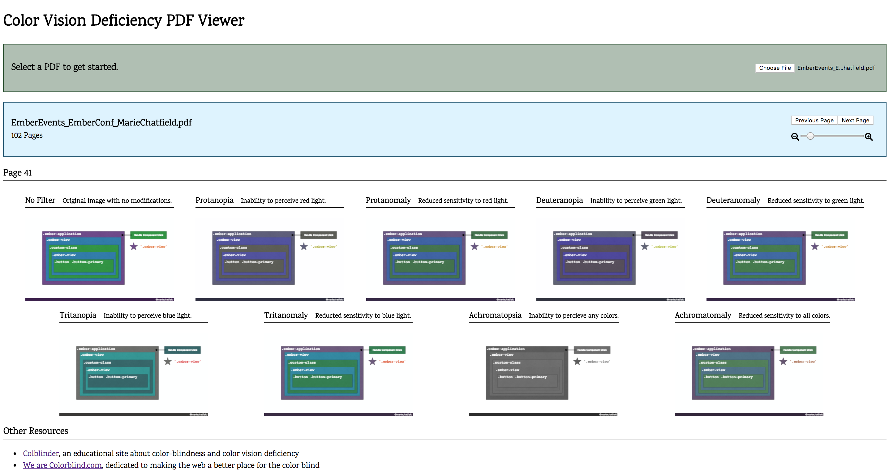

# Simple PDF Viewer

#### Preview PDFs in the browser with eight different variations of color vision deficiency.



See it live at [mariechatfield.com/simple-pdf-viewer](http://mariechatfield.com/simple-pdf-viewer).

Uses the [PDF.js](https://mozilla.github.io/pdf.js/) platform, created by Mozilla, to render the PDFs.

Uses the color blind SVG filters found in the [colourblind](https://github.com/Altreus/colourblind) bookmarklet created by [Alastair Douglas](https://github.com/Altreus).

Recommended Resources:

* [Colblinder](http://www.color-blindness.com/), an educational site about color-blindness and color vision deficiency
* [We are Colorblind.com](http://wearecolorblind.com/), dedicated to making the web a better place for the color blind
* [Colour Blind Awareness](http://www.colourblindawareness.org/), U.K. based community interest organization
* [18F Accessibility Guide](https://accessibility.18f.gov/index.html), resources and tools to help develop accessible products
* [Improving The Color Accessibility For Color-Blind Users](https://www.smashingmagazine.com/2016/06/improving-color-accessibility-for-color-blind-users/), article in Smashing Magazine
* [Spectrum](https://chrome.google.com/webstore/detail/spectrum/ofclemegkcmilinpcimpjkfhjfgmhieb?hl=en), a free color vision deficiency simulator for Chrome
* [Color Oracle](http://colororacle.org/), a free color blindness simulator for Windows, Mac, and Linux

## Contributing

This website consists of a single HTML page, and JavaScript and CSS files. It's hosted by the GitHub Pages built-in server.

If you want to run it locally, you'll need to host the `index.html` file with a local server in order to load the JavaScript. (For security, most browsers do not load JavaScript for a local file.)

My favorite way:

Assuming that you have `node` installed on your computer, with the `npx` command to run scripts, you don't need to install anything else. Use the [`http-server` library](https://www.npmjs.com/package/http-server) to run a tiny Node.js server that automatically hosts the `index.html` file for you.

```
cd simple-pdf-viewer
npx http-server -o
```

This will open http://localhost:8080 or http://127.0.0.1:8080 for you, and return the main HTML page for this website with ability to load JavaScript and CSS.
